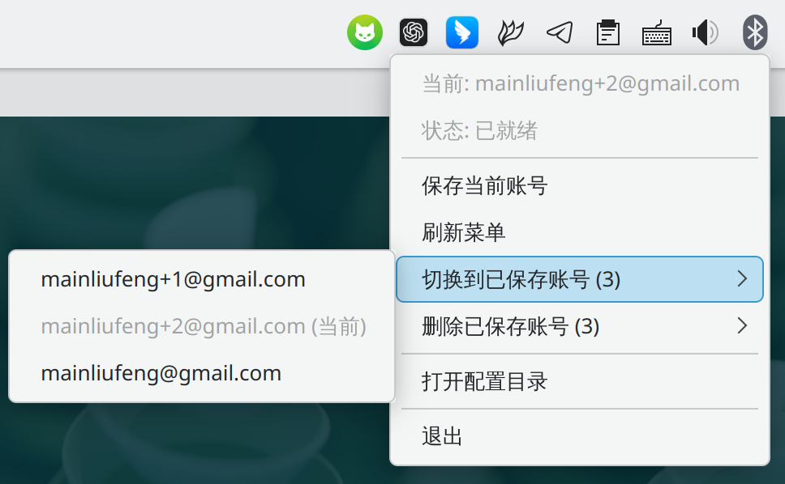

# codex-switch

`codex-switch` 是一个面向 Linux + Xorg 的 Codex 账号切换托盘工具。



它只做本地快照管理，不负责登录流程：

- 保存当前 `~/.codex/auth.json`
- 按邮箱切换到任意已保存账号
- 删除已保存账号
- 在同一个子菜单里显示 `5h / 周窗` 文本进度条和准确剩余百分比

## 技术栈

- Go
- [`getlantern/systray`](https://github.com/getlantern/systray)
- GTK3 + Ayatana AppIndicator

## 依赖

### Arch Linux

```bash
sudo pacman -S --needed base-devel go pkgconf gtk3 libayatana-appindicator xdg-utils
```

如果要显示账号用量，本机还需要可用的 `codex` CLI。

## 工作方式

程序会读取当前的 `~/.codex/auth.json`，从其中 `tokens.id_token` 的 JWT payload 解析邮箱，并把这个邮箱当作显示名和快照键。

保存后的快照目录默认是：

```text
~/.local/share/codex-switch/profiles/
```

如果设置了 `XDG_DATA_HOME`，则会写到：

```text
$XDG_DATA_HOME/codex-switch/profiles/
```

每个已保存账号对应一个 JSON 快照文件，切换时会直接用所选快照覆盖 `~/.codex/auth.json`。

## 构建

```bash
./scripts/build.sh
```

产物：

```text
dist/codex-switch
```

## 安装

用户级安装：

```bash
./scripts/install.sh
```

安装完成后会写入：

```text
~/.local/bin/codex-switch
~/.local/share/applications/codex-switch.desktop
```

如果希望登录后自动启动：

```bash
./scripts/install.sh --autostart
```

如果要移除自动启动：

```bash
./scripts/install.sh --no-autostart
```

卸载：

```bash
./scripts/uninstall.sh
```

如果连同已保存账号快照一起删除：

```bash
./scripts/uninstall.sh --purge-data
```

## 使用

推荐流程：

1. 在 Codex CLI 里登录一个账号。
2. 启动 `Codex Switch`，点击 `保存当前账号`。
3. 切到另一个账号重新登录 Codex。
4. 再次点击 `保存当前账号`。
5. 之后就可以在 `切换账号` 子菜单里直接切换。

菜单结构：

- `保存当前账号`
- `刷新菜单`
- `切换账号`
- `删除已保存账号`
- `打开配置目录`
- `退出`

其中 `切换账号` 子菜单里：

- 邮箱那一行可直接点击切换
- `５ｈ / 周窗` 两行显示剩余进度条和准确百分比
- 用量还没取到时，账号仍然可以先切换

## Makepkg / AUR

仓库包含 [PKGBUILD](/home/liufeng/Code/self/codex-switch/PKGBUILD) 和 [.SRCINFO](/home/liufeng/Code/self/codex-switch/.SRCINFO)。

本地直接打包安装：

```bash
makepkg -si
```

## 测试

已验证的命令：

```bash
go test ./...
./scripts/build.sh
go test ./scripts
```

## 已知限制

- 当前目标环境是 Linux + Xorg。
- 托盘菜单是唯一交互入口，没有独立管理窗口。
- 邮箱依赖 `tokens.id_token` 中的 `email` claim；如果当前 `auth.json` 缺少这个字段，程序不会保存该配置。
- 用量读取依赖 `codex app-server`；如果当前机器上的 Codex CLI 不支持该 RPC，用量区会显示 `暂不可用`，但账号切换本身仍可用。

## 图标来源

- 图形基于 OpenAI 2025 Blossom 标志。
- 本仓库内使用的是根据公开 SVG 生成的本地图标文件，分别用于 tray 和桌面启动器。
